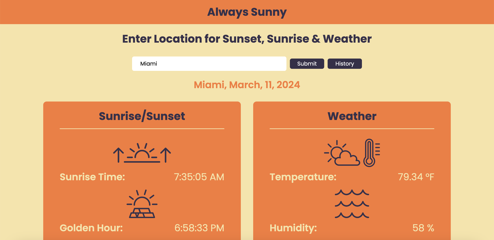

# Always_Sunny_Project

## Description

This is a website where the user inputs a city to know the weather details as well as the sun times namely the surise, the sunset, etc. This is accomplished using two seperate API's. Initially if the User gives access to their location they will have the same details for their neighborhood. The user can also use the History button which will open a modal with cities that they have recently searched and on selecting any of the buttons within the modal they will get the weather and the sun times too.
Welcome to Always Sunny and do not forget to make the most of the Golden Hour.

## Technologies
HTML, CSS, JAVASCRIPT, JQuery

## Installation:
No dependencies are required to make the application work.

## Repository
This is a Github link to the projects repository.
https://github.com/magellanrose/Always_Sunny_Project

## Usage
Enter a city into the search bar for the application to give you the information. Example below: 

## License
MIT license

## Credits
Freddy, Jasvinder, Jessica, and Nick all contributed to this project.

## Documentation
We used https://openweather.co.uk/ for the weather API. 
We used https://sunrisesunset.io/api/ for the sunset/sunrise API.

## Contact Information
Freddy Github: https://github.com/freddylau815 
Nick Github: https://github.com/magellanrose 
Jasvinder Github: https://github.com/jsaini1727 
Jessica Github: https://github.com/Jlvstrasse

## Mock Up

